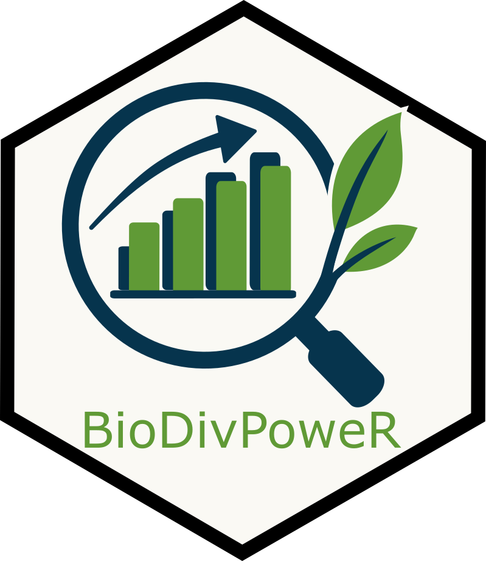

# BioDivPoweR 

### R package for assessing power of biodiversity monitoring sampling schemes. 
#### Accompanying Tekwa et al. (forthcoming)


Reliable biodiversity monitoring requires understanding how sampling effort influences detectability of meaningful changes in species richness. Yet robust methods for quantifying statistical power are lacking because richness is a cumulative metric: biodiversity assessments typically compare two communities, rather than means across independent replicates, making traditional power analyses inappropriate.

`BioDivPoweR` allows for simulation-based quality-assurance power analysis on user-provided pilot data to detect richness differences at different sampling efforts within communities.


## Package Installation

```r
install.packages("devtools")
devtools::install_github("jakelawlor/BioDivPoweR")
```

## Usage

The workflow contains only two functions, that must be run in order. The workflow can either be used for a two-treatment analysis -- for example, detecting a differences in richness between high vegetation and low vegetation sites -- or within a single treatment -- for detecting changes in richness in one sampling location over time. 

### Bootstrap Pilot Data

First, `bootstrap_pilot()` creates bootstrapped simulated communities from user-provided pilot data to achieve a sense of possible richness differences given community structure. The output of this function will contain simulated community pairs that span a range of reasonable potential effect sizes, which will be used to evaluate ability to detect change across sample scheme coverage. 

See the function help page for details on customizable variables for refining the resolution of the boostrap step. 

```r
# get example pilot data, or supply your own
# here, using a two-treatment scenario:
data("pilot_two_trts")

# run bootstrap function:
two_trt_boots <- bootstrap_pilot(pilot_two_trts,
                                 method = "two",
                                 category_col = "veg_score")
```


### Downsample bootstrapped communities

Second, `downsample_boots()` uses replicated simulated communities with known differences in richness (effect sizes) to simulate the differences that would be detected if fewer samples were taken. This function produces a functional relationship between sample coverage (the proportion of the community thought to be present in the given sample number), and the minimum difference in richness that can be confidently detected. 

The function also offers several user-defined additions, such as target effect sizes that users want to confidently detect, the cost of samples, and the power with which users want to detect differences. See the function help page for details.

```r
# downsample bootstrapped communities across sample sizes (community coverage)
two_trt_sub <- subsample_boots(two_trt_boots,
                               pilot_two_trts,
                               method = "two")
```

### Example Output

Together, these functions produce the relationship between sample size and power in the pilot community, that can be used to guide continued sampling to optimize sampling effort, sampling power, and expected effect sizes of richness change. 

 


## Contact

This package was developed my Jake Lawlor to functionalize the workflow developed by Eden Tekwa. 

For questions regarding package functionality, contact Jake Lawlor at jake.lawlor@mail.mcgill.ca. For more on the methiod, our publication on the method is forthcoming. 


## License

This package is **source-available**, not open source.

It is licensed under the **PolyForm Noncommercial License**.
You may use, modify, and share this software for:
- academic research;
- teaching and educational purposes;
- internal use by government agencies;

provided that such use is **not in connection with paid consulting,
contract work, or other compensated services**.

You may **not** use this software for:
- paid consulting;
- contract work;
- commercial or revenue-generating services.

If you wish to use this software commercially, please contact us for a
separate commercial license.
